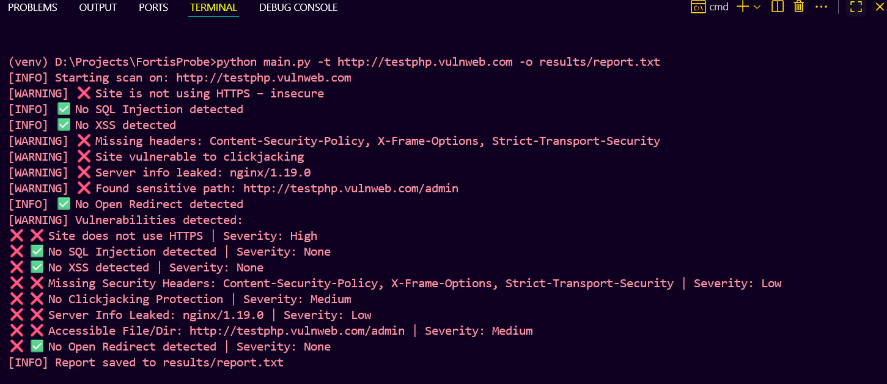
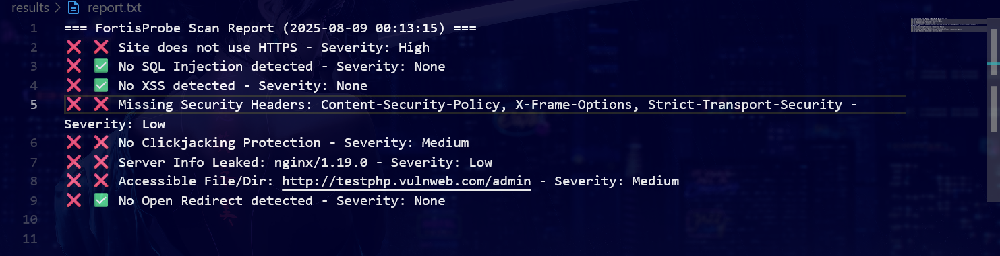

# 🔍 FortisProbe - Lightweight OWASP Top 10 Vulnerability Scanner

FortisProbe is a lightweight, command-line based security scanner designed to detect common vulnerabilities inspired by the **OWASP Top 10**.  
It is built for **quick assessments**, **learning security concepts**, and **demonstrating vulnerability detection techniques** in interviews or hackathons.

---

## ✨ Features
- ✅ Detects common web vulnerabilities
- ✅ Clear terminal output with pass/fail indicators
- ✅ Saves scan results to a file (rewrites each run)
- ✅ Works on any target URL
- ✅ Simple to use & extend
- ✅ Cross-platform support (Windows, Mac, Linux)

---

## 📂 Project Structure
FortisProbe/
│
├── main.py
├── requirements.txt
├── scanner/
│ ├── init.py
│ ├── vulnerability_scanner.py
│ ├── reports.py
│ └── utils.py
├── results/
│ └── report.txt
├── assets/
│ ├── screenshot.png
│ └── demo.mp4
└── README.md

---

## 🚀 Installation & Usage

### 1️⃣ Clone the Repository
```bash
git clone https://github.com/ankan20/FortisProbe.git
cd FortisProbe
# Create venv
python -m venv venv

# Activate venv
# Windows:
venv\Scripts\activate
# Linux/Mac:
source venv/bin/activate

# Install requirements
pip install -r requirements.txt
python main.py -t https://example.com -o results/report.txt

```
Example Output
Terminal Output
[INFO] Starting scan for target: https://example.com
✅ SQL Injection test passed
❌ XSS test failed - Severity: High
✅ CSRF test passed
[INFO] Report saved to results/report.txt

Report File (results/report.txt)
--- Scan Report (2025-08-08 14:33:21) ---
SQL Injection - Severity: None
XSS - Severity: High
CSRF - Severity: None

## 📸 Screenshots

### 1. Terminal Output


### 2. Generated Report File



## 🎥 Demo Video
## 🎥 Demo Video

[▶ Watch the demo video here](https://drive.google.com/file/d/1yqqbPj4S81eR_1GNoKQKCUfpTnyHz1uY/view?usp=sharing)

